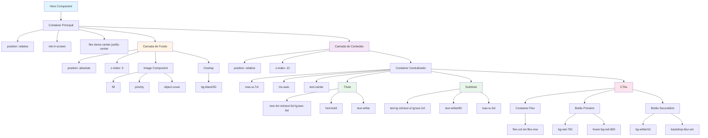

# Documentação: Seção Hero - Implementação e Arquitetura

## 1. Visão Geral

### O que é uma Hero Section

A Hero Section é a primeira seção visual que o usuário vê ao acessar uma página web. É uma área de destaque que geralmente ocupa toda a altura da viewport (tela visível) e serve como uma "porta de entrada" visual para o site. Sua função principal é:

- **Capturar atenção**: Primeira impressão visual impactante
- **Comunicar valor**: Apresentar a proposta de valor da empresa de forma clara e concisa
- **Direcionar ação**: Incluir CTAs (Call-to-Actions) que guiam o usuário para ações importantes
- **Estabelecer identidade**: Transmitir a personalidade e valores da marca através de design e conteúdo

### Tecnologias utilizadas

- **Next.js**: Framework React para renderização e otimização de imagens
- **React**: Biblioteca JavaScript para construção de interfaces
- **TypeScript**: Superset do JavaScript com tipagem estática
- **Tailwind CSS**: Framework CSS utility-first para estilização responsiva
- **Next.js Image**: Componente otimizado para carregamento eficiente de imagens

### Estrutura de arquivos

```
src/
├── components/
│   └── Hero.tsx                    # Componente principal do Hero
├── app/
│   └── page.tsx                    # Página home onde o Hero é utilizado
└── public/
    └── hero.png                    # Imagem de fundo do Hero
```

---

## 2. Arquitetura e Estrutura em Camadas

### Por que usar camadas?

A arquitetura em camadas permite criar uma composição visual complexa onde diferentes elementos ocupam o mesmo espaço, mas em profundidades diferentes (z-index). Isso é essencial para criar efeitos como:

- Imagem de fundo que cobre toda a área
- Overlay escuro para melhorar legibilidade do texto
- Conteúdo (texto e botões) sobreposto e bem visível

### Hierarquia de camadas

```
Hero Component (section)
├── Container Principal (relative)
│   ├── Camada de Fundo (absolute, z-0)
│   │   ├── Image (hero.png) - Preenche toda a área
│   │   └── Overlay (bg-black/50) - Camada escura semi-transparente
│   └── Camada de Conteúdo (relative, z-10)
│       ├── Container Centralizado (max-w-7xl mx-auto)
│       │   ├── Título (h1) - Texto principal
│       │   ├── Subtítulo (p) - Descrição complementar
│       │   └── CTAs (div) - Botões de ação
│       └── Scroll Indicator (opcional) - Indicador de scroll
```

### Diagrama visual da estrutura

```
┌─────────────────────────────────────────┐
│  Hero Section (relative, min-h-screen)  │
│  ┌───────────────────────────────────┐  │
│  │  Camada de Fundo (absolute, z-0)  │  │
│  │  ┌─────────────────────────────┐  │  │
│  │  │  Imagem (fill, object-cover) │  │  │
│  │  └─────────────────────────────┘  │  │
│  │  ┌─────────────────────────────┐  │  │
│  │  │  Overlay (bg-black/50)     │  │  │
│  │  └─────────────────────────────┘  │  │
│  └───────────────────────────────────┘  │
│  ┌───────────────────────────────────┐  │
│  │  Camada de Conteúdo (relative, z-10)│
│  │  ┌─────────────────────────────┐  │  │
│  │  │  Container Centralizado     │  │  │
│  │  │  ┌───────────────────────┐  │  │  │
│  │  │  │  Título (h1)          │  │  │  │
│  │  │  └───────────────────────┘  │  │  │
│  │  │  ┌───────────────────────┐  │  │  │
│  │  │  │  Subtítulo (p)        │  │  │  │
│  │  │  └───────────────────────┘  │  │  │
│  │  │  ┌───────────────────────┐  │  │  │
│  │  │  │  Botões CTA           │  │  │  │
│  │  │  └───────────────────────┘  │  │  │
│  │  └─────────────────────────────┘  │  │
│  └───────────────────────────────────┘  │
└─────────────────────────────────────────┘
```

---

## 3. Conceitos Técnicos Fundamentais

### Posicionamento CSS: relative, absolute e z-index

#### `position: relative`

O container principal usa `position: relative` para estabelecer um **contexto de posicionamento**. Isso significa que:

- O elemento permanece no fluxo normal do documento
- Elementos filhos com `position: absolute` serão posicionados **relativos a este container**, não ao body ou viewport
- Permite usar `z-index` para controlar a ordem de empilhamento

**Exemplo:**
```tsx
<section className="relative min-h-screen">
  {/* Este é o contexto de referência para elementos absolutos */}
</section>
```

#### `position: absolute`

A camada de fundo usa `position: absolute` para:

- **Remover do fluxo normal**: O elemento não ocupa espaço no layout
- **Posicionar relativo ao pai**: Com `inset-0`, o elemento preenche todo o espaço do container pai
- **Ficar "atrás" do conteúdo**: Usando `z-0`, fica abaixo do conteúdo

**Exemplo:**
```tsx
<div className="absolute inset-0 z-0">
  {/* inset-0 = top: 0, right: 0, bottom: 0, left: 0 */}
  {/* Preenche todo o espaço do container pai */}
</div>
```

#### `z-index` - Ordem de empilhamento

O `z-index` controla qual elemento fica "na frente" quando há sobreposição:

- **z-0**: Camada de fundo (imagem e overlay) - fica atrás
- **z-10**: Camada de conteúdo (texto e botões) - fica na frente

**Regra importante**: `z-index` só funciona em elementos com `position` diferente de `static` (relative, absolute, fixed, sticky).

**Exemplo:**
```tsx
{/* Camada de fundo - z-0 (atrás) */}
<div className="absolute inset-0 z-0">
  <Image src="/hero.png" fill />
</div>

{/* Camada de conteúdo - z-10 (na frente) */}
<div className="relative z-10">
  <h1>Título</h1>
</div>
```

### Flexbox para centralização

O Hero usa Flexbox para centralizar o conteúdo vertical e horizontalmente:

#### Centralização vertical e horizontal

```tsx
<section className="relative min-h-screen flex items-center justify-center">
  {/* 
    min-h-screen: Altura mínima = 100vh (altura da tela)
    flex: Ativa Flexbox
    items-center: Centraliza verticalmente (cross-axis)
    justify-center: Centraliza horizontalmente (main-axis)
  */}
</section>
```

**Explicação:**
- `flex`: Transforma o container em um flex container
- `items-center`: Alinha itens no eixo cruzado (verticalmente, em layout row)
- `justify-center`: Alinha itens no eixo principal (horizontalmente, em layout row)

#### Layout responsivo dos botões

```tsx
<div className="flex flex-col sm:flex-row gap-4">
  {/* 
    flex-col: Empilha botões verticalmente (mobile)
    sm:flex-row: Coloca botões lado a lado em telas >= 640px
    gap-4: Espaçamento de 16px entre botões
  */}
</div>
```

### Responsividade com Tailwind CSS

O Tailwind usa uma abordagem **mobile-first**, onde você define o estilo base para mobile e depois adiciona estilos para telas maiores.

#### Breakpoints do Tailwind

| Prefixo | Largura mínima | Uso comum |
|---------|---------------|-----------|
| (sem prefixo) | 0px | Mobile (padrão) |
| `sm:` | 640px | Tablets pequenos |
| `md:` | 768px | Tablets |
| `lg:` | 1024px | Desktops |
| `xl:` | 1280px | Desktops grandes |
| `2xl:` | 1536px | Telas muito grandes |

#### Exemplo de tipografia responsiva

```tsx
<h1 className="text-4xl md:text-5xl lg:text-6xl font-bold">
  {/* 
    text-4xl: 36px no mobile
    md:text-5xl: 48px em tablets (>= 768px)
    lg:text-6xl: 60px em desktops (>= 1024px)
  */}
</h1>
```

#### Exemplo de espaçamento responsivo

```tsx
<div className="px-4 md:px-8 lg:px-12">
  {/* 
    px-4: 16px de padding horizontal no mobile
    md:px-8: 32px em tablets
    lg:px-12: 48px em desktops
  */}
</div>
```

### Otimização de imagens no Next.js

O Next.js oferece otimização automática de imagens através do componente `Image`:

#### Características do componente Image

```tsx
<Image
  src="/hero.png"
  alt="Hero background"
  fill
  priority
  quality={90}
  className="object-cover"
/>
```

**Propriedades importantes:**

- **`fill`**: A imagem preenche o container pai (requer `position: relative` no pai)
- **`priority`**: Marca a imagem como prioritária para carregamento (LCP - Largest Contentful Paint)
- **`quality={90}`**: Qualidade de compressão (0-100). 90 oferece bom balance entre qualidade e tamanho
- **`object-cover`**: A imagem cobre todo o espaço mantendo proporção (como `background-size: cover`)

**Benefícios:**
- **Lazy loading automático**: Imagens são carregadas apenas quando necessário
- **Otimização de formato**: Next.js serve WebP quando suportado pelo browser
- **Redimensionamento**: Imagens são redimensionadas automaticamente para diferentes tamanhos de tela
- **Performance**: Reduz significativamente o tempo de carregamento

---

## 4. Estrutura do Código

### Interface TypeScript para Props

```typescript
interface HeroProps {
  title: string;
  subtitle: string;
  image: string;
  ctaPrimary: {
    text: string;
    href: string;
  };
  ctaSecondary?: {
    text: string;
    href: string;
  };
}
```

**Explicação:**
- `title` e `subtitle`: Textos obrigatórios (string)
- `image`: Caminho da imagem de fundo
- `ctaPrimary`: Botão principal obrigatório (objeto com `text` e `href`)
- `ctaSecondary`: Botão secundário opcional (marcado com `?`)

### Análise linha por linha do componente

#### Container principal

```tsx
<section className="relative min-h-screen flex items-center justify-center">
```

- `section`: Elemento semântico HTML5 para seções
- `relative`: Estabelece contexto de posicionamento
- `min-h-screen`: Altura mínima = 100vh (altura da viewport)
- `flex items-center justify-center`: Centraliza conteúdo vertical e horizontalmente

#### Camada de fundo

```tsx
<div className="absolute inset-0 z-0">
  <Image
    src={image}
    alt="Hero background"
    fill
    priority
    quality={90}
    className="object-cover"
  />
  <div className="absolute inset-0 bg-black/50" />
</div>
```

**Camada de imagem:**
- `absolute inset-0 z-0`: Posiciona absolutamente, preenche todo o espaço, z-index 0
- `fill`: Imagem preenche o container
- `priority`: Carregamento prioritário
- `object-cover`: Cobre todo o espaço mantendo proporção

**Overlay:**
- `absolute inset-0`: Sobrepoe a imagem
- `bg-black/50`: Fundo preto com 50% de opacidade (melhora legibilidade)

#### Camada de conteúdo

```tsx
<div className="relative z-10 px-4 md:px-8 lg:px-12">
  <div className="max-w-7xl mx-auto text-center space-y-8">
```

- `relative z-10`: Fica na frente da camada de fundo
- `px-4 md:px-8 lg:px-12`: Padding horizontal responsivo
- `max-w-7xl`: Largura máxima de 1280px (conteúdo não fica muito largo)
- `mx-auto`: Centraliza horizontalmente
- `text-center`: Alinha texto ao centro
- `space-y-8`: Espaçamento vertical de 32px entre elementos filhos

#### Título

```tsx
<h1 className="text-4xl md:text-5xl lg:text-6xl font-bold text-white">
  {title}
</h1>
```

- Tamanhos responsivos: 36px → 48px → 60px
- `font-bold`: Peso da fonte 700
- `text-white`: Cor branca para contraste com fundo escuro

#### Subtítulo

```tsx
<p className="text-lg md:text-xl lg:text-2xl text-white/90 max-w-3xl mx-auto">
  {subtitle}
</p>
```

- Tamanhos responsivos: 18px → 20px → 24px
- `text-white/90`: Branco com 90% de opacidade (mais sutil que o título)
- `max-w-3xl`: Largura máxima de 768px (linhas não ficam muito longas)
- `mx-auto`: Centraliza o parágrafo

#### Botões CTA

```tsx
<div className="flex flex-col sm:flex-row gap-4 justify-center">
  <Link
    href={ctaPrimary.href}
    className="bg-red-700 hover:bg-red-800 text-white px-8 py-3 rounded-lg font-semibold transition-all duration-300 transform hover:scale-105"
  >
    {ctaPrimary.text}
  </Link>
  {ctaSecondary && (
    <Link
      href={ctaSecondary.href}
      className="bg-white/10 backdrop-blur-sm hover:bg-white/20 text-white px-8 py-3 rounded-lg font-semibold border border-white/20 transition-all duration-300"
    >
      {ctaSecondary.text}
    </Link>
  )}
</div>
```

**Botão primário:**
- `bg-red-700`: Fundo vermelho (alinhado com identidade visual)
- `hover:bg-red-800`: Escurece no hover
- `transform hover:scale-105`: Aumenta 5% no hover (efeito sutil)
- `transition-all duration-300`: Transição suave de 300ms

**Botão secundário:**
- `bg-white/10`: Fundo branco com 10% de opacidade
- `backdrop-blur-sm`: Efeito glassmorphism (desfoque do fundo)
- `border border-white/20`: Borda branca semi-transparente
- Renderização condicional: Só aparece se `ctaSecondary` for fornecido

---

## 5. Como Personalizar

### Modificar cores

#### Alterar cor do botão primário

```tsx
// De vermelho para azul
className="bg-blue-700 hover:bg-blue-800 ..."
```

#### Alterar opacidade do overlay

```tsx
// De 50% para 60% (mais escuro)
<div className="absolute inset-0 bg-black/60" />

// De 50% para 40% (mais claro)
<div className="absolute inset-0 bg-black/40" />
```

#### Alterar cor do texto

```tsx
// Texto preto (se o fundo for claro)
className="... text-gray-900"

// Texto com gradiente
className="... bg-gradient-to-r from-blue-600 to-purple-600 bg-clip-text text-transparent"
```

### Modificar tipografia

#### Alterar tamanhos de fonte

```tsx
// Título maior
<h1 className="text-5xl md:text-6xl lg:text-7xl ...">

// Subtítulo menor
<p className="text-base md:text-lg lg:text-xl ...">
```

#### Alterar fontes

No `globals.css` ou `tailwind.config.js`:

```css
/* Adicionar fonte personalizada */
@import url('https://fonts.googleapis.com/css2?family=Inter:wght@400;600;700&display=swap');

/* Aplicar no Hero */
<h1 className="font-['Inter'] ...">
```

### Modificar layout

#### Alterar altura do Hero

```tsx
// Altura completa da tela (padrão)
<section className="... min-h-screen">

// Altura de 80% da tela
<section className="... min-h-[80vh]">

// Altura fixa
<section className="... h-[600px]">
```

#### Alterar posicionamento do conteúdo

```tsx
// Conteúdo à esquerda
<div className="... text-left">

// Conteúdo à direita
<div className="... text-right">

// Conteúdo no topo
<section className="... items-start">

// Conteúdo no centro (padrão)
<section className="... items-center">
```

### Adicionar elementos

#### Adicionar scroll indicator

```tsx
<div className="absolute bottom-8 left-1/2 transform -translate-x-1/2 z-10">
  <div className="animate-bounce">
    <ChevronDown className="w-6 h-6 text-white" />
  </div>
</div>
```

#### Adicionar gradiente no overlay

```tsx
// Overlay com gradiente
<div className="absolute inset-0 bg-gradient-to-b from-black/60 via-black/50 to-black/70" />
```

#### Adicionar animações de entrada

```tsx
// Com Framer Motion
import { motion } from "framer-motion";

<motion.h1
  initial={{ opacity: 0, y: 20 }}
  animate={{ opacity: 1, y: 0 }}
  transition={{ duration: 0.6 }}
  className="..."
>
  {title}
</motion.h1>
```

### Modificar imagem

#### Trocar imagem de fundo

```tsx
<Hero
  image="/nova-imagem.jpg"
  // ... outras props
/>
```

#### Adicionar vídeo de fundo (alternativa)

```tsx
<div className="absolute inset-0 z-0">
  <video
    autoPlay
    loop
    muted
    playsInline
    className="w-full h-full object-cover"
  >
    <source src="/hero-video.mp4" type="video/mp4" />
  </video>
  <div className="absolute inset-0 bg-black/50" />
</div>
```

---

## 6. Responsividade Detalhada

### Breakpoints e adaptações

#### Mobile (< 640px)

- **Layout**: Botões empilhados verticalmente (`flex-col`)
- **Tipografia**: Tamanhos menores (`text-4xl`, `text-lg`)
- **Padding**: Menor (`px-4`)
- **Espaçamento**: Compacto (`space-y-6`)

#### Tablet (640px - 1024px)

- **Layout**: Botões lado a lado (`sm:flex-row`)
- **Tipografia**: Tamanhos médios (`md:text-5xl`, `md:text-xl`)
- **Padding**: Médio (`md:px-8`)

#### Desktop (>= 1024px)

- **Layout**: Conteúdo com largura máxima (`max-w-7xl`)
- **Tipografia**: Tamanhos grandes (`lg:text-6xl`, `lg:text-2xl`)
- **Padding**: Generoso (`lg:px-12`)

### Testando responsividade

1. **DevTools do navegador**: F12 → Toggle device toolbar (Ctrl+Shift+M)
2. **Breakpoints para testar**: 375px, 640px, 768px, 1024px, 1280px
3. **Verificar**: Texto legível, botões clicáveis, imagem bem posicionada

---

## 7. Boas Práticas

### Acessibilidade

#### Texto alternativo descritivo

```tsx
<Image
  src={image}
  alt="Equipe da Centauro trabalhando em soluções de segurança e tecnologia"
  // ... outras props
/>
```

#### Contraste adequado

- **Texto sobre fundo escuro**: Use `text-white` ou cores claras
- **Texto sobre fundo claro**: Use `text-gray-900` ou cores escuras
- **WCAG AA**: Contraste mínimo de 4.5:1 para texto normal, 3:1 para texto grande

#### Navegação por teclado

```tsx
<Link
  href={ctaPrimary.href}
  className="... focus:outline-none focus:ring-2 focus:ring-red-500 focus:ring-offset-2"
>
  {ctaPrimary.text}
</Link>
```

### Performance

#### Otimização de imagens

- **Formato**: Use WebP quando possível (Next.js faz isso automaticamente)
- **Tamanho**: Comprima imagens antes de adicionar ao projeto (use ferramentas como TinyPNG)
- **Lazy loading**: Use `priority` apenas para Hero (primeira imagem visível)

#### Carregamento prioritário

```tsx
<Image
  priority // Apenas para Hero (LCP - Largest Contentful Paint)
  // ... outras props
/>
```

### SEO

#### Estrutura semântica

```tsx
<section> {/* Semântico */}
  <h1> {/* Título principal da página */}
  <p> {/* Descrição */}
</section>
```

#### Meta tags (no layout.tsx ou page.tsx)

```tsx
export const metadata = {
  title: "Centauro - Soluções em Segurança e Tecnologia",
  description: "Oferecemos soluções integradas em segurança e tecnologia para sua empresa.",
};
```

---

## 8. Diagrama de Estrutura Completo



---

## 9. Exemplos Práticos

### Exemplo 1: Código completo comentado

```tsx
"use client"; // Se usar hooks ou interatividade

import Image from "next/image";
import Link from "next/link";

interface HeroProps {
  title: string;
  subtitle: string;
  image: string;
  ctaPrimary: {
    text: string;
    href: string;
  };
  ctaSecondary?: {
    text: string;
    href: string;
  };
}

export default function Hero({
  title = "Soluções Integradas em Segurança e Tecnologia",
  subtitle = "Oferecemos serviços completos para proteger e modernizar sua empresa",
  image = "/hero.png",
  ctaPrimary = {
    text: "Solicitar Orçamento",
    href: "/contato",
  },
  ctaSecondary,
}: HeroProps) {
  return (
    // Container principal - estabelece contexto de posicionamento
    <section className="relative min-h-screen flex items-center justify-center">
      
      {/* CAMADA DE FUNDO - Fica atrás do conteúdo (z-0) */}
      <div className="absolute inset-0 z-0">
        {/* Imagem de fundo otimizada pelo Next.js */}
        <Image
          src={image}
          alt="Hero background"
          fill // Preenche o container pai
          priority // Carregamento prioritário (LCP)
          quality={90} // Qualidade de compressão
          className="object-cover" // Cobre todo o espaço mantendo proporção
        />
        {/* Overlay escuro para melhorar legibilidade do texto */}
        <div className="absolute inset-0 bg-black/50" />
      </div>

      {/* CAMADA DE CONTEÚDO - Fica na frente (z-10) */}
      <div className="relative z-10 px-4 md:px-8 lg:px-12 w-full">
        {/* Container centralizado com largura máxima */}
        <div className="max-w-7xl mx-auto text-center space-y-8">
          
          {/* TÍTULO PRINCIPAL */}
          <h1 className="text-4xl md:text-5xl lg:text-6xl font-bold text-white">
            {title}
          </h1>

          {/* SUBTÍTULO */}
          <p className="text-lg md:text-xl lg:text-2xl text-white/90 max-w-3xl mx-auto">
            {subtitle}
          </p>

          {/* BOTÕES CTA */}
          <div className="flex flex-col sm:flex-row gap-4 justify-center">
            {/* Botão primário */}
            <Link
              href={ctaPrimary.href}
              className="bg-red-700 hover:bg-red-800 text-white px-8 py-3 rounded-lg font-semibold transition-all duration-300 transform hover:scale-105"
            >
              {ctaPrimary.text}
            </Link>

            {/* Botão secundário (opcional) */}
            {ctaSecondary && (
              <Link
                href={ctaSecondary.href}
                className="bg-white/10 backdrop-blur-sm hover:bg-white/20 text-white px-8 py-3 rounded-lg font-semibold border border-white/20 transition-all duration-300"
              >
                {ctaSecondary.text}
              </Link>
            )}
          </div>
        </div>
      </div>
    </section>
  );
}
```

### Exemplo 2: Uso na página home

```tsx
// src/app/page.tsx
import Hero from "@/components/Hero";

export default function Home() {
  return (
    <main className="pt-20"> {/* pt-20 compensa navbar fixa */}
      <Hero
        title="Soluções Integradas em Segurança e Tecnologia"
        subtitle="A Centauro oferece serviços completos de segurança física, eletrônica e soluções tecnológicas para proteger e modernizar sua empresa."
        image="/hero.png"
        ctaPrimary={{
          text: "Solicitar Orçamento",
          href: "/contato",
        }}
        ctaSecondary={{
          text: "Conheça Nossos Serviços",
          href: "/servicos",
        }}
      />
      {/* Outras seções da página */}
    </main>
  );
}
```

### Exemplo 3: Hero com gradiente no overlay

```tsx
{/* Overlay com gradiente do preto para transparente */}
<div className="absolute inset-0 bg-gradient-to-b from-black/70 via-black/50 to-black/30" />
```

### Exemplo 4: Hero com conteúdo à esquerda

```tsx
<div className="max-w-7xl mx-auto text-left"> {/* text-left em vez de text-center */}
  <div className="max-w-2xl"> {/* Limita largura do conteúdo */}
    <h1>...</h1>
    <p>...</p>
  </div>
</div>
```

### Exemplo 5: Hero com scroll indicator

```tsx
import { ChevronDown } from "lucide-react";

// No final do componente, antes do fechamento da section
<div className="absolute bottom-8 left-1/2 transform -translate-x-1/2 z-10">
  <div className="animate-bounce">
    <ChevronDown className="w-6 h-6 text-white" />
  </div>
</div>
```

---

## 10. Troubleshooting

### Problemas comuns e soluções

#### Imagem não aparece

**Problema**: A imagem não é exibida.

**Soluções**:
1. Verifique se o arquivo existe em `/public/hero.png`
2. Verifique o caminho: deve começar com `/` (ex: `/hero.png`, não `hero.png`)
3. Verifique se o container pai tem `position: relative` quando usar `fill`

#### Texto não está legível

**Problema**: O texto não tem contraste suficiente.

**Soluções**:
1. Aumente a opacidade do overlay: `bg-black/60` ou `bg-black/70`
2. Adicione sombra no texto: `text-shadow: 0 2px 4px rgba(0,0,0,0.5)`
3. Use cores mais escuras no texto se o fundo for claro

#### Botões não estão centralizados

**Problema**: Os botões ficam desalinhados.

**Soluções**:
1. Verifique se o container tem `justify-center`
2. Verifique se não há margens extras nos botões
3. Use `mx-auto` no container dos botões

#### Hero não ocupa toda a altura

**Problema**: O Hero é menor que a tela.

**Soluções**:
1. Verifique se tem `min-h-screen` (não `h-screen`)
2. Verifique se não há padding/margin que reduza a altura
3. Verifique se o body/html não tem altura limitada

---

## Conclusão

A seção Hero é um componente fundamental para criar uma primeira impressão impactante. Esta documentação cobre:

- ✅ Arquitetura em camadas com posicionamento CSS
- ✅ Conceitos de Flexbox e responsividade
- ✅ Otimização de imagens com Next.js
- ✅ Personalização completa de cores, tipografia e layout
- ✅ Boas práticas de acessibilidade e performance
- ✅ Exemplos práticos e troubleshooting

Para mais informações sobre Next.js Image: [Next.js Image Optimization](https://nextjs.org/docs/pages/api-reference/components/image)

Para mais informações sobre Tailwind CSS: [Tailwind CSS Documentation](https://tailwindcss.com/docs)
