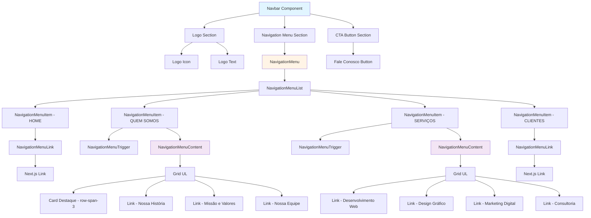

# Documentação: Navbar com Dropdown - Implementação Shadcn/ui

## 1. Visão Geral

### O que é o componente

O Navbar é um componente de navegação fixo no topo da página que oferece uma experiência de navegação moderna e intuitiva. Ele combina links simples e menus dropdown para organizar o conteúdo de forma hierárquica e acessível.

### Tecnologias utilizadas

- **Next.js**: Framework React para renderização e roteamento
- **shadcn/ui**: Biblioteca de componentes UI baseada em Radix UI
- **Radix UI**: Biblioteca de componentes acessíveis e sem estilo
- **Tailwind CSS**: Framework CSS utility-first para estilização
- **class-variance-authority (cva)**: Utilitário para gerenciar variantes de classes CSS
- **lucide-react**: Biblioteca de ícones

### Estrutura de arquivos

```
src/
├── components/
│   ├── Navbar.tsx                    # Componente principal do navbar
│   └── ui/
│       └── navigation-menu.tsx        # Componentes base do NavigationMenu (shadcn/ui)
├── lib/
│   └── utils.ts                       # Função cn() para combinar classes
└── app/
    ├── layout.tsx                     # Layout raiz onde o Navbar é importado
    └── globals.css                    # Estilos globais e variáveis CSS
```

---

## 2. Arquitetura e Componentes

### Explicação do NavigationMenu do shadcn/ui

O `NavigationMenu` é um componente complexo que fornece uma estrutura completa para menus de navegação com suporte a dropdowns, animações e acessibilidade. Ele é construído sobre o primitivo `@radix-ui/react-navigation-menu`, que garante:

- **Acessibilidade**: Suporte completo a ARIA e navegação por teclado
- **Animações suaves**: Transições automáticas ao abrir/fechar dropdowns
- **Posicionamento inteligente**: Ajuste automático do dropdown para não sair da viewport
- **Estados gerenciados**: Controle automático do estado aberto/fechado

### Hierarquia de componentes

A estrutura hierárquica do NavigationMenu segue esta ordem:

```
NavigationMenu (container principal)
  └── NavigationMenuList (lista de itens)
      └── NavigationMenuItem (item individual)
          ├── NavigationMenuLink (para links simples)
          └── NavigationMenuTrigger + NavigationMenuContent (para dropdowns)
              └── NavigationMenuViewport (viewport onde o conteúdo aparece)
```

### Diferença entre links simples e dropdowns

- **Links Simples**: Usam `NavigationMenuLink` com `asChild` e um componente `Link` do Next.js. Redirecionam diretamente para uma página.
- **Dropdowns**: Usam `NavigationMenuTrigger` (botão que abre o menu) + `NavigationMenuContent` (conteúdo que aparece). Permitem exibir múltiplos links organizados em um grid.

---

## 3. Estrutura do Código

### Análise linha por linha das seções principais

#### Logo (esquerda)

```20:25:src/components/Navbar.tsx
        <div className="flex items-center gap-2 flex-1">
          <div className="w-8 h-8 bg-slate-900 rounded-sm" />
          <span className="text-xl font-bold tracking-tighter text-slate-900">
            PROTOTIPO
          </span>
        </div>
```

- `flex-1`: Ocupa o espaço disponível à esquerda
- Logo visual: Um quadrado escuro (`bg-slate-900`) de 8x8
- Texto: "PROTOTIPO" em negrito com tracking reduzido

#### Menu de navegação (centro)

```28:201:src/components/Navbar.tsx
        <div className="hidden md:flex items-center absolute left-1/2 transform -translate-x-1/2">
          <NavigationMenu>
            <NavigationMenuList>
              {/* Link simples - HOME */}
              <NavigationMenuItem>
                <NavigationMenuLink asChild>
                  <Link
                    href="/"
                    className={cn(
                      "group inline-flex h-9 w-max items-center justify-center rounded-md bg-background px-4 py-2 text-sm font-medium hover:bg-accent hover:text-accent-foreground focus:bg-accent focus:text-accent-foreground focus-visible:outline-none focus-visible:ring-2 focus-visible:ring-ring focus-visible:ring-offset-2 disabled:pointer-events-none disabled:opacity-50 data-[active]:bg-accent/50 data-[state=open]:bg-accent/50 text-zinc-950 hover:text-red-700 transition-colors"
                    )}
                  >
                    HOME
                  </Link>
                </NavigationMenuLink>
              </NavigationMenuItem>
```

- `hidden md:flex`: Oculto em mobile, visível a partir de telas médias
- `absolute left-1/2 transform -translate-x-1/2`: Centralização absoluta horizontal
- Contém todos os itens de navegação dentro de `NavigationMenuList`

#### Botão CTA (direita)

```205:212:src/components/Navbar.tsx
        <div className="hidden md:flex items-center flex-1 justify-end">
          <Link
            href="#contato"
            className="bg-slate-900 text-white px-5 py-2 rounded-full hover:bg-red-700 transition-all"
          >
            Fale Conosco
          </Link>
        </div>
```

- `flex-1 justify-end`: Ocupa espaço à direita e alinha o conteúdo ao final
- Botão com fundo escuro que muda para vermelho no hover
- `rounded-full`: Bordas completamente arredondadas (pill shape)

### Explicação do layout com Flexbox e posicionamento absoluto

O navbar usa uma combinação inteligente de Flexbox e posicionamento absoluto:

1. **Container principal**: `flex` com `items-center` para alinhamento vertical
2. **Logo**: `flex-1` para ocupar espaço à esquerda
3. **Menu central**: `absolute left-1/2 -translate-x-1/2` para centralização perfeita, independente do conteúdo lateral
4. **Botão CTA**: `flex-1 justify-end` para ocupar espaço à direita e alinhar ao final

Essa abordagem garante que o menu fique sempre centralizado, mesmo se o logo ou o botão mudarem de tamanho.

---

## 4. Conceitos Importantes

### `"use client"` - Por que é necessário

```1:1:src/components/Navbar.tsx
"use client";
```

O `NavigationMenu` do Radix UI utiliza hooks do React (como `useState`, `useEffect`) e eventos de interação do usuário (cliques, hovers). Essas funcionalidades só funcionam no lado do cliente (browser), não durante a renderização no servidor (SSR) do Next.js.

**Sem `"use client"`**: O componente tentaria usar hooks durante o SSR, causando erros.

**Com `"use client"`**: O Next.js sabe que este componente deve ser renderizado apenas no cliente, após o JavaScript carregar.

### `asChild` - Padrão Radix UI para composição

```33:42:src/components/Navbar.tsx
                <NavigationMenuLink asChild>
                  <Link
                    href="/"
                    className={cn(
                      "group inline-flex h-9 w-max items-center justify-center rounded-md bg-background px-4 py-2 text-sm font-medium hover:bg-accent hover:text-accent-foreground focus:bg-accent focus:text-accent-foreground focus-visible:outline-none focus-visible:ring-2 focus-visible:ring-ring focus-visible:ring-offset-2 disabled:pointer-events-none disabled:opacity-50 data-[active]:bg-accent/50 data-[state=open]:bg-accent/50 text-zinc-950 hover:text-red-700 transition-colors"
                    )}
                  >
                    HOME
                  </Link>
                </NavigationMenuLink>
```

O `asChild` é um padrão do Radix UI que permite **composição de componentes** sem criar elementos DOM extras.

- **Sem `asChild`**: Renderizaria `<NavigationMenuLink><Link>HOME</Link></NavigationMenuLink>` (dois elementos)
- **Com `asChild`**: Renderiza apenas `<Link>HOME</Link>`, mas com todas as funcionalidades do `NavigationMenuLink` (acessibilidade, estados, etc.)

Isso é essencial para usar o `Link` do Next.js, que precisa ser o elemento raiz para funcionar corretamente com o roteamento.

### `NavigationMenuTrigger` vs `NavigationMenuLink`

- **`NavigationMenuTrigger`**: Usado para itens que abrem um dropdown. Renderiza um botão com ícone de seta que indica que há conteúdo adicional.
- **`NavigationMenuLink`**: Usado para links simples que redirecionam diretamente. Não tem dropdown associado.

### Integração com Next.js Link (sem legacyBehavior)

O código usa o `Link` do Next.js 13+ (App Router), que não requer mais a prop `legacyBehavior`. O componente funciona diretamente como um elemento `<a>` estilizado, mantendo todas as otimizações de roteamento do Next.js.

---

## 5. Tipos de Itens de Menu

### Links Simples: HOME e CLIENTES

```32:43:src/components/Navbar.tsx
              <NavigationMenuItem>
                <NavigationMenuLink asChild>
                  <Link
                    href="/"
                    className={cn(
                      "group inline-flex h-9 w-max items-center justify-center rounded-md bg-background px-4 py-2 text-sm font-medium hover:bg-accent hover:text-accent-foreground focus:bg-accent focus:text-accent-foreground focus-visible:outline-none focus-visible:ring-2 focus-visible:ring-ring focus-visible:ring-offset-2 disabled:pointer-events-none disabled:opacity-50 data-[active]:bg-accent/50 data-[state=open]:bg-accent/50 text-zinc-950 hover:text-red-700 transition-colors"
                    )}
                  >
                    HOME
                  </Link>
                </NavigationMenuLink>
              </NavigationMenuItem>
```

Estrutura:
- `NavigationMenuItem` → `NavigationMenuLink` (com `asChild`) → `Link` do Next.js

### Dropdowns: QUEM SOMOS e SERVIÇOS

```46:114:src/components/Navbar.tsx
              <NavigationMenuItem>
                <NavigationMenuTrigger className="text-zinc-950 hover:text-red-700 data-[state=open]:text-red-700">
                  QUEM SOMOS
                </NavigationMenuTrigger>
                <NavigationMenuContent>
                  <ul className="grid w-[400px] gap-3 p-4 md:w-[500px] md:grid-cols-2 lg:w-[600px]">
                    <li className="row-span-3">
                      <NavigationMenuLink asChild>
                        <a
                          className="flex h-full w-full select-none flex-col justify-end rounded-md bg-gradient-to-b from-muted/50 to-muted p-6 no-underline outline-none focus:shadow-md"
                          href="/"
                        >
                          <div className="mb-2 mt-4 text-lg font-medium">
                            Sobre Nós
                          </div>
                          <p className="text-sm leading-tight text-muted-foreground">
                            Conheça nossa história, missão e valores.
                          </p>
                        </a>
                      </NavigationMenuLink>
                    </li>
                    <li>
                      <NavigationMenuLink asChild>
                        <Link
                          href="#historia"
                          className="block select-none space-y-1 rounded-md p-3 leading-none no-underline outline-none transition-colors hover:bg-accent hover:text-accent-foreground focus:bg-accent focus:text-accent-foreground"
                        >
                          <div className="text-sm font-medium leading-none">
                            Nossa História
                          </div>
                          <p className="line-clamp-2 text-sm leading-snug text-muted-foreground">
                            Trajetória da empresa desde o início
                          </p>
                        </Link>
                      </NavigationMenuLink>
                    </li>
```

Estrutura:
- `NavigationMenuItem` → `NavigationMenuTrigger` (botão) + `NavigationMenuContent` (conteúdo)
- Dentro do `NavigationMenuContent`: `<ul>` com grid responsivo
- Cada `<li>` contém um `NavigationMenuLink` com `asChild`

### Estrutura de grid nos dropdowns

```51:51:src/components/Navbar.tsx
                  <ul className="grid w-[400px] gap-3 p-4 md:w-[500px] md:grid-cols-2 lg:w-[600px]">
```

- **Mobile**: Grid de 1 coluna, largura 400px
- **Tablet (md)**: Grid de 2 colunas, largura 500px
- **Desktop (lg)**: Grid de 2 colunas, largura 600px
- `gap-3`: Espaçamento de 12px entre itens

### Card destacado no dropdown "QUEM SOMOS"

```52:66:src/components/Navbar.tsx
                    <li className="row-span-3">
                      <NavigationMenuLink asChild>
                        <a
                          className="flex h-full w-full select-none flex-col justify-end rounded-md bg-gradient-to-b from-muted/50 to-muted p-6 no-underline outline-none focus:shadow-md"
                          href="/"
                        >
                          <div className="mb-2 mt-4 text-lg font-medium">
                            Sobre Nós
                          </div>
                          <p className="text-sm leading-tight text-muted-foreground">
                            Conheça nossa história, missão e valores.
                          </p>
                        </a>
                      </NavigationMenuLink>
                    </li>
```

- `row-span-3`: Ocupa 3 linhas do grid (destaque visual)
- `bg-gradient-to-b from-muted/50 to-muted`: Gradiente de fundo sutil
- `justify-end`: Alinha o conteúdo ao final (parte inferior do card)
- Funciona como um "hero card" dentro do dropdown

---

## 6. Estilização

### Classes Tailwind utilizadas

#### Container do Navbar

```17:17:src/components/Navbar.tsx
    <nav className="fixed top-0 w-full z-50 bg-white/80 backdrop-blur-md border-b border-slate-100">
```

- `fixed top-0`: Fixado no topo da página
- `z-50`: Z-index alto para ficar sobre outros elementos
- `bg-white/80`: Fundo branco com 80% de opacidade
- `backdrop-blur-md`: Efeito de desfoque no fundo (glassmorphism)
- `border-b border-slate-100`: Borda inferior sutil

#### Links e Triggers

- `text-zinc-950`: Cor do texto (quase preto)
- `hover:text-red-700`: Cor vermelha no hover
- `transition-colors`: Transição suave de cores
- `data-[state=open]:text-red-700`: Cor vermelha quando o dropdown está aberto

### Sistema de cores

O navbar utiliza um esquema de cores minimalista:

- **Primária**: `zinc-950` (texto escuro)
- **Destaque/Hover**: `red-700` (vermelho para interações)
- **Fundo**: `white/80` com `backdrop-blur-md` (efeito glass)
- **Bordas**: `slate-100` (cinza muito claro)

### Responsividade

```28:28:src/components/Navbar.tsx
        <div className="hidden md:flex items-center absolute left-1/2 transform -translate-x-1/2">
```

- `hidden md:flex`: Menu oculto em telas pequenas, visível a partir de 768px
- **Mobile**: Apenas logo visível (ou menu hambúrguer, se implementado)
- **Desktop**: Menu completo com todos os itens

### Animações e transições

O `NavigationMenu` do Radix UI inclui animações automáticas:

- **Abertura do dropdown**: Fade-in + slide-in
- **Fechamento**: Fade-out + slide-out
- **Ícone de seta**: Rotação de 180° quando o dropdown abre
- **Hover nos links**: Transição suave de cor (`transition-colors`)

As animações são configuradas no componente `NavigationMenuContent`:

```93:94:src/components/ui/navigation-menu.tsx
        "data-[motion^=from-]:animate-in data-[motion^=to-]:animate-out data-[motion^=from-]:fade-in data-[motion^=to-]:fade-out data-[motion=from-end]:slide-in-from-right-52 data-[motion=from-start]:slide-in-from-left-52 data-[motion=to-end]:slide-out-to-right-52 data-[motion=to-start]:slide-out-to-left-52 top-0 left-0 w-full p-2 pr-2.5 md:absolute md:w-auto",
```

---

## 7. Como Personalizar

### Adicionar novos links simples

Para adicionar um novo link simples (como HOME ou CLIENTES):

```tsx
<NavigationMenuItem>
  <NavigationMenuLink asChild>
    <Link
      href="/seu-link"
      className={cn(
        "group inline-flex h-9 w-max items-center justify-center rounded-md bg-background px-4 py-2 text-sm font-medium hover:bg-accent hover:text-accent-foreground focus:bg-accent focus:text-accent-foreground focus-visible:outline-none focus-visible:ring-2 focus-visible:ring-ring focus-visible:ring-offset-2 disabled:pointer-events-none disabled:opacity-50 data-[active]:bg-accent/50 data-[state=open]:bg-accent/50 text-zinc-950 hover:text-red-700 transition-colors"
      )}
    >
      SEU LINK
    </Link>
  </NavigationMenuLink>
</NavigationMenuItem>
```

### Adicionar novos dropdowns

Para adicionar um novo dropdown (como QUEM SOMOS ou SERVIÇOS):

```tsx
<NavigationMenuItem>
  <NavigationMenuTrigger className="text-zinc-950 hover:text-red-700 data-[state=open]:text-red-700">
    SEU DROPDOWN
  </NavigationMenuTrigger>
  <NavigationMenuContent>
    <ul className="grid w-[400px] gap-3 p-4 md:w-[500px] md:grid-cols-2 lg:w-[600px]">
      <li>
        <NavigationMenuLink asChild>
          <Link
            href="#link1"
            className="block select-none space-y-1 rounded-md p-3 leading-none no-underline outline-none transition-colors hover:bg-accent hover:text-accent-foreground focus:bg-accent focus:text-accent-foreground"
          >
            <div className="text-sm font-medium leading-none">
              Título do Link
            </div>
            <p className="line-clamp-2 text-sm leading-snug text-muted-foreground">
              Descrição do link
            </p>
          </Link>
        </NavigationMenuLink>
      </li>
      {/* Adicione mais <li> conforme necessário */}
    </ul>
  </NavigationMenuContent>
</NavigationMenuItem>
```

### Modificar conteúdo dos dropdowns

1. **Adicionar mais itens**: Adicione novos `<li>` dentro do `<ul>`
2. **Remover itens**: Delete os `<li>` desejados
3. **Modificar textos**: Altere o conteúdo dentro de cada `<div>` e `<p>`
4. **Alterar links**: Modifique o `href` em cada `Link` ou `<a>`

### Alterar estilos e cores

#### Mudar cor do hover

Substitua `hover:text-red-700` por outra cor do Tailwind:

```tsx
className="text-zinc-950 hover:text-blue-700"
```

#### Mudar cor de fundo do navbar

```tsx
<nav className="fixed top-0 w-full z-50 bg-blue-50/80 backdrop-blur-md border-b border-blue-100">
```

#### Personalizar grid do dropdown

Ajuste as classes do grid:

```tsx
<ul className="grid w-[500px] gap-4 p-6 md:w-[600px] md:grid-cols-3 lg:w-[800px]">
```

- `w-[500px]`: Largura base
- `gap-4`: Espaçamento maior
- `md:grid-cols-3`: 3 colunas em tablets
- `lg:w-[800px]`: Largura maior em desktop

---

## 8. Diagrama de Estrutura



---

## 9. Exemplos Práticos

### Exemplo 1: Código comentado explicando cada parte

```tsx
"use client"; // Necessário porque usamos hooks e interações do cliente

import Link from "next/link";
import {
  NavigationMenu,
  NavigationMenuContent,
  NavigationMenuItem,
  NavigationMenuLink,
  NavigationMenuList,
  NavigationMenuTrigger,
} from "@/components/ui/navigation-menu";

export default function Navbar() {
  return (
    // Container principal fixo no topo
    <nav className="fixed top-0 w-full z-50 bg-white/80 backdrop-blur-md border-b border-slate-100">
      {/* Container interno com largura máxima e padding */}
      <div className="max-w-7xl mx-auto px-6 h-20 flex items-center">
        
        {/* SEÇÃO 1: LOGO (ESQUERDA) */}
        <div className="flex items-center gap-2 flex-1">
          {/* Ícone do logo */}
          <div className="w-8 h-8 bg-slate-900 rounded-sm" />
          {/* Texto do logo */}
          <span className="text-xl font-bold tracking-tighter text-slate-900">
            PROTOTIPO
          </span>
        </div>

        {/* SEÇÃO 2: MENU DE NAVEGAÇÃO (CENTRO) */}
        <div className="hidden md:flex items-center absolute left-1/2 transform -translate-x-1/2">
          {/* Componente principal do menu */}
          <NavigationMenu>
            {/* Lista de itens do menu */}
            <NavigationMenuList>
              
              {/* ITEM 1: Link Simples - HOME */}
              <NavigationMenuItem>
                {/* Link do menu (com asChild para usar Next.js Link) */}
                <NavigationMenuLink asChild>
                  {/* Link do Next.js com estilização */}
                  <Link
                    href="/"
                    className="text-zinc-950 hover:text-red-700 transition-colors"
                  >
                    HOME
                  </Link>
                </NavigationMenuLink>
              </NavigationMenuItem>

              {/* ITEM 2: Dropdown - QUEM SOMOS */}
              <NavigationMenuItem>
                {/* Botão que abre o dropdown */}
                <NavigationMenuTrigger className="text-zinc-950 hover:text-red-700">
                  QUEM SOMOS
                </NavigationMenuTrigger>
                {/* Conteúdo do dropdown */}
                <NavigationMenuContent>
                  {/* Grid responsivo para organizar os links */}
                  <ul className="grid w-[400px] gap-3 p-4 md:w-[500px] md:grid-cols-2 lg:w-[600px]">
                    {/* Card destacado (ocupa 3 linhas) */}
                    <li className="row-span-3">
                      <NavigationMenuLink asChild>
                        <a href="/sobre" className="...">
                          <div>Sobre Nós</div>
                          <p>Conheça nossa história...</p>
                        </a>
                      </NavigationMenuLink>
                    </li>
                    {/* Links normais do dropdown */}
                    <li>
                      <NavigationMenuLink asChild>
                        <Link href="#historia" className="...">
                          <div>Nossa História</div>
                          <p>Trajetória da empresa...</p>
                        </Link>
                      </NavigationMenuLink>
                    </li>
                  </ul>
                </NavigationMenuContent>
              </NavigationMenuItem>

            </NavigationMenuList>
          </NavigationMenu>
        </div>

        {/* SEÇÃO 3: BOTÃO CTA (DIREITA) */}
        <div className="hidden md:flex items-center flex-1 justify-end">
          <Link
            href="#contato"
            className="bg-slate-900 text-white px-5 py-2 rounded-full hover:bg-red-700 transition-all"
          >
            Fale Conosco
          </Link>
        </div>
        
      </div>
    </nav>
  );
}
```

### Exemplo 2: Adicionar um novo dropdown "PRODUTOS"

```tsx
{/* Dropdown - PRODUTOS */}
<NavigationMenuItem>
  <NavigationMenuTrigger className="text-zinc-950 hover:text-red-700 data-[state=open]:text-red-700">
    PRODUTOS
  </NavigationMenuTrigger>
  <NavigationMenuContent>
    <ul className="grid w-[400px] gap-3 p-4 md:w-[500px] md:grid-cols-2 lg:w-[600px]">
      <li>
        <NavigationMenuLink asChild>
          <Link
            href="/produtos/web"
            className="block select-none space-y-1 rounded-md p-3 leading-none no-underline outline-none transition-colors hover:bg-accent hover:text-accent-foreground focus:bg-accent focus:text-accent-foreground"
          >
            <div className="text-sm font-medium leading-none">
              Desenvolvimento Web
            </div>
            <p className="line-clamp-2 text-sm leading-snug text-muted-foreground">
              Sites e aplicações modernas
            </p>
          </Link>
        </NavigationMenuLink>
      </li>
      <li>
        <NavigationMenuLink asChild>
          <Link
            href="/produtos/mobile"
            className="block select-none space-y-1 rounded-md p-3 leading-none no-underline outline-none transition-colors hover:bg-accent hover:text-accent-foreground focus:bg-accent focus:text-accent-foreground"
          >
            <div className="text-sm font-medium leading-none">
              Aplicativos Mobile
            </div>
            <p className="line-clamp-2 text-sm leading-snug text-muted-foreground">
              Apps iOS e Android nativos
            </p>
          </Link>
        </NavigationMenuLink>
      </li>
    </ul>
  </NavigationMenuContent>
</NavigationMenuItem>
```

### Exemplo 3: Modificar cores para tema azul

```tsx
// No Navbar.tsx, substitua as classes de cor:

// Links e triggers
className="text-blue-950 hover:text-blue-600 data-[state=open]:text-blue-600"

// Botão CTA
className="bg-blue-900 text-white px-5 py-2 rounded-full hover:bg-blue-700 transition-all"

// Navbar background
<nav className="fixed top-0 w-full z-50 bg-blue-50/80 backdrop-blur-md border-b border-blue-100">
```

### Exemplo 4: Adicionar ícone ao logo

```tsx
import { Building2 } from "lucide-react";

// No lugar do div do logo:
<div className="flex items-center gap-2 flex-1">
  <Building2 className="w-8 h-8 text-slate-900" />
  <span className="text-xl font-bold tracking-tighter text-slate-900">
    PROTOTIPO
  </span>
</div>
```

---

## Conclusão

Este navbar oferece uma solução completa e moderna para navegação, combinando:

- ✅ Acessibilidade (Radix UI)
- ✅ Performance (Next.js)
- ✅ Flexibilidade (fácil personalização)
- ✅ Design moderno (glassmorphism, animações suaves)
- ✅ Responsividade (adaptável a diferentes telas)

Para mais informações sobre os componentes shadcn/ui, visite: [shadcn/ui Documentation](https://ui.shadcn.com)

Para documentação do Radix UI Navigation Menu: [Radix UI Docs](https://www.radix-ui.com/primitives/docs/components/navigation-menu)
